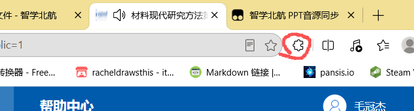
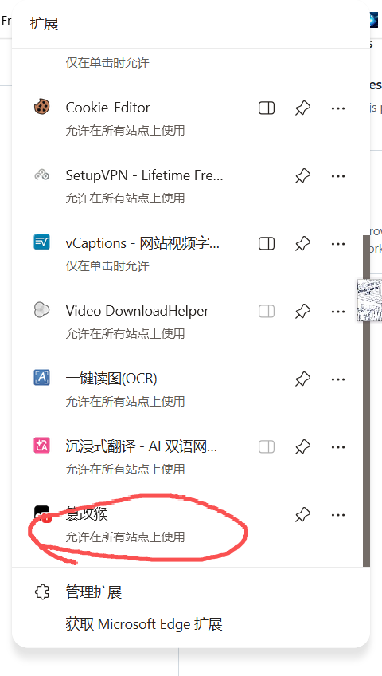
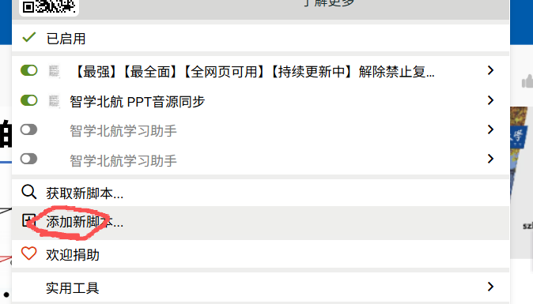
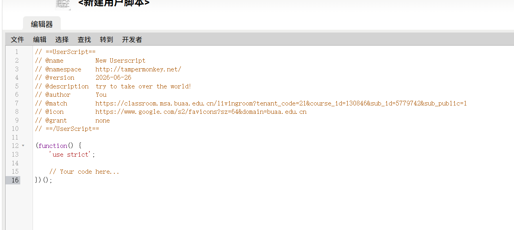

# 智学北航 课堂增强脚本集

[](https://opensource.org/licenses/MIT)

智学北航（classroom.msa.buaa.edu.cn）直播教室的 Tampermonkey 油猴脚本合集。

---

## 🎬 语音识别字幕

`buaa-live-subtitle.user.js`

将课堂语音识别内容作为字幕实时叠加在视频画面上，再也不用低头看侧边栏的识别文字了。

### 原理

解析页面 `.trans-list_wrap` 中的语音识别记录（时间戳 + 文本），监听视频 `timeupdate` 事件，二分查找当前播放时间对应的字幕，渲染为视频上方的 overlay。

```
.trans-list_wrap                     video.timeupdate
  ├── 00:02:10                           ↓
  ├── 给大家给上一课咱们讲      →   二分匹配  →  字幕 overlay
  ├── 00:02:19
  └── 我们稍微再呼吸一下
```

### 功能

- ✅ 实时字幕 — 视频播放时自动匹配对应时间戳的识别文本
- ✅ 二分查找 — 高效定位当前字幕，2958 条数据也无延迟
- ✅ 动态更新 — 新识别内容自动加入字幕列表
- ✅ 美观 overlay — 半透明黑底白字，居中显示在视频底部

### 安装

[点击安装字幕脚本](https://github.com/Tukist/buaa-audio-sync/raw/master/buaa-live-subtitle.user.js)

---

## 🔊 PPT音源同步

`buaa-audio-sync.user.js`

解决切换 PPT 流时音频消失的问题。

### 问题

智学北航的直播教室，教师流和 PPT 流共享同一个 `<video>` 元素。当你切换到 PPT 画面时，平台会把视频源从教师流（有声音）换成 PPT 流（无声音），导致完全听不到讲课。

### 原理

脚本创建一个**隐藏的克隆视频元素**，锁定教师流 URL 独立播放音频。原始视频随平台自由切换教师/PPT 画面，声音始终从克隆视频输出。

```
原始 <video>  ← 平台随便切换（教师 ⇄ PPT），正常显示画面
隐藏 <video>  ← 克隆，锁定教师流，实时同步进度、暂停、音量
```

### 安装

安装 [Tampermonkey](https://www.tampermonkey.net/) 浏览器扩展

**建议**









然后直接把js文件里面内容复制粘贴上去

或者

[点击安装脚本](https://github.com/Tukist/buaa-audio-sync/raw/master/buaa-audio-sync.user.js)

或手动：Tampermonkey → 管理面板 → 实用工具 → 导入 → 选择 `buaa-audio-sync.user.js`

### 功能

- ✅ 切换 PPT 画面时音频不中断
- ✅ 暂停/播放同步 — 按暂停键克隆视频同步暂停
- ✅ 音量同步 — 调音量克隆视频同步变化
- ✅ 进度同步 — 拖动进度条克隆视频同步跳转
- ✅ 切回教师视图自动重新同步
- ✅ 右下角浮动面板，绿灯=正常，橙灯=PPT模式
- ✅ 点击面板可临时关闭

### 兼容性

| 浏览器 | 状态 |
|--------|------|
| Edge | ✅ |
| Chrome | ✅ |
| Firefox | ✅（需 Tampermonkey） |

## 许可

MIT License
